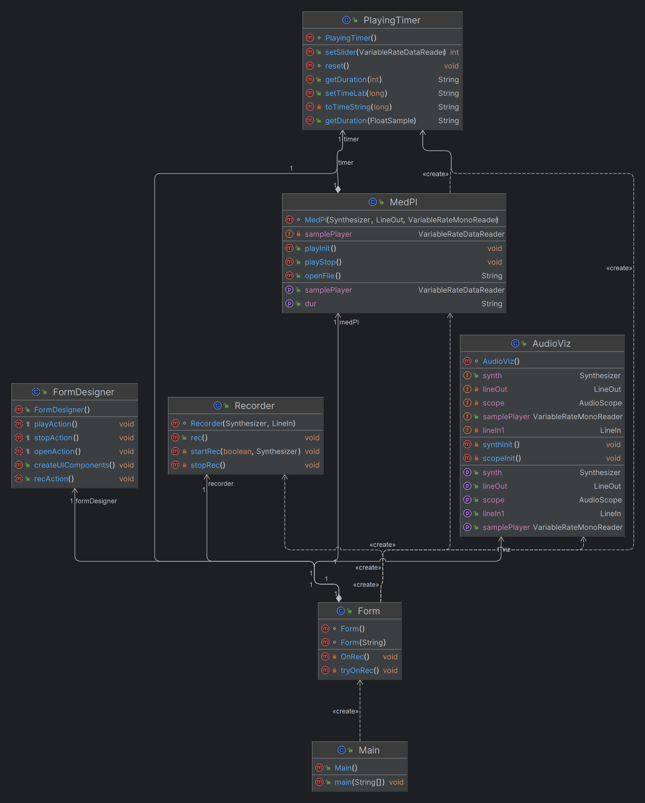

## Jsyn Wav Recording-Playback App

The application is created using the Intellij IDEA GUI designer.
It records voice from a microphone, saves it into a WAV file named "temp_recording.wav", 
visualizing the sound graphically both when recording and not.

### - Class diagram

